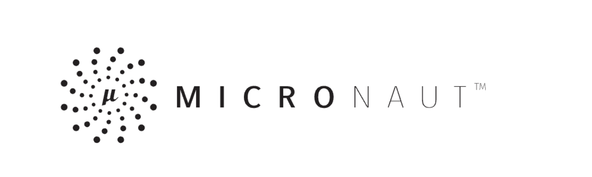

       
 
              
              
              
              
       

#

<h1 align="center"> SEEK </h1>

Project to understand and apply:

       * Elasticsearch 
       * Build CI pipeline - Jenkins
       * Aws Lambda - Serverless
       * Compare cold start and memory footprint between:
              * Spring Boot
              * Micronaut
              * Quarkus
